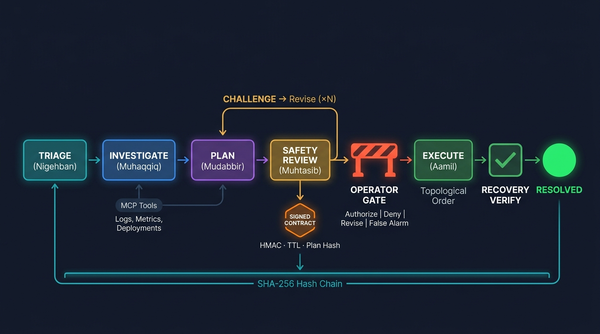

# 🛡️ MuhafizSRE: Operator-Governed Incident Command Room

> **محافظ** (Muhafiz) — *"Guardian"* in Urdu

> *AI investigates. Operators authorize. The contract decides what executes.*

**Multi-agent SRE prototype where five AI agents triage, investigate, plan, and challenge remediation autonomously — but only an operator-authorized contract can mutate infrastructure. Built for the Kaggle AI Agents Capstone.**

Built for the [Kaggle AI Agents: Intensive Vibe Coding Capstone Project](https://kaggle.com/competitions/vibecoding-agents-capstone-project) — **Track 2: Agents for Business**.

**🎥 Demo video (4:20):** [YouTube](https://www.youtube.com/watch?v=lXDDH1bb5ZI) · **🚀 Live app:** [Cloud Run](https://muhafizsre-851586299411.us-central1.run.app)

---

## 📋 Table of Contents

- [Problem Statement](#-problem-statement)
- [Solution Overview](#-solution-overview)
- [Architecture](#-architecture)
- [The Muhafiz Fleet](#-the-muhafiz-fleet--agent-profiles)
- [Key Features](#-key-features)
- [Project Structure](#-project-structure)
- [Quick Start](#-quick-start)
- [API Reference](#-api-reference)
- [Dashboard](#-dashboard)
- [Security Model](#-security-model)
- [Evaluation Framework](#-evaluation-framework)
- [Testing](#-testing)
- [Honest Disclosure](#-honest-disclosure)
- [Documentation](#-documentation)
- [License](#-license)

---

## 🔥 Problem Statement

**Enterprise downtime is costly** — industry reports estimate thousands of dollars per minute for critical services. When production incidents strike, Site Reliability Engineers (SREs) face a crushing bottleneck:

1. **Alert Fatigue** — A large fraction of alerts are noise, drowning out real incidents
2. **Manual Diagnosis** — Cross-referencing logs, deployments, and metrics takes 15-30 minutes
3. **Compliance Overhead** — Enterprise change governance requires documented approval chains, adding bureaucratic delay
4. **Operator Bottleneck** — Critical decisions wait for on-call engineers to wake up and context-switch

The result: **Mean Time To Recovery (MTTR) can stretch well beyond what is acceptable** for incidents that could be resolved significantly faster.

---

## 💡 Solution Overview

**MuhafizSRE** deploys a fleet of 5 specialized AI agents — the **Muhafiz Fleet** (محافظ فلیٹ) — that handle the full incident lifecycle autonomously, while requiring operator authorization only for production-changing execution. Every executed action is cryptographically bound to the approved contract:

```
Alert → Triage → Diagnosis → Plan → Safety Review → [Operator Authorization] → Execute → Verify → Seal
```

### What Makes It Different

| Feature | Description |
|---------|-------------|
| **Hash-Chained Event Ledger** | Every agent action is recorded in a SHA-256 hash chain — tamper-evident and auditable |
| **Approval Contracts** | Tamper-evident execution contracts with HMAC-signed tokens, single-use nonces, and TTL expiry |
| **Prompt Injection Defense** | Telemetry sanitizer flags adversarial patterns before agent review; execution remains bounded by typed skills, Muhtasib safety review, and HMAC approval contracts |
| **Action Policy Engine** | Skill allowlist, service allowlist, bounded parameters, cycle detection |
| **Live SSE Dashboard** | Real-time incident monitoring with evidence drawers and plan diffs |
| **Deterministic Recovery Verification** | Post-execution health checks confirm actual service recovery |

---

## 🏗️ Architecture



```
┌─────────────────────────────────────────────────────────────┐
│                    Gateway (FastAPI + SSE)                    │
│  ┌──────────┐  ┌──────────┐  ┌───────────┐  ┌───────────┐  │
│  │ Incident │  │  Event   │  │ Approval  │  │    SSE    │  │
│  │  Store   │  │  Chain   │  │ Contracts │  │  Stream   │  │
│  │ (SQLite) │  │ (SHA256) │  │  (HMAC)   │  │  (Live)   │  │
│  └──────────┘  └──────────┘  └───────────┘  └───────────┘  │
├─────────────────────────────────────────────────────────────┤
│         Routed Agent Pipeline (ADK 2.x — AgentRoom)          │
│                                                              │
│  Nigehban → Muhaqqiq → Mudabbir → Muhtasib → Aamil          │
│  (Triage)   (Diagnose)  (Plan)    (Review)   (Execute)       │
│                                                              │
│  Phase 1: Triage → Investigate → Plan → Safety Review        │
│  Phase 2: [Operator Authorization] → Execute → Verify → Seal │
├─────────────────────────────────────────────────────────────┤
│  MCP Server (Telemetry)  │  Skill Adapters  │  Dashboard     │
│  Cloud Logging, Metrics  │  6 Remediation   │  Next.js SSE   │
│  GitHub Deployments      │  Skills          │  Live Updates   │
└─────────────────────────────────────────────────────────────┘
```

### Technology Stack

| Component | Technology |
|-----------|-----------|
| **Agent Framework** | Google ADK 2.x (gateway-orchestrated, explicitly routed ADK multi-agent workflow) |
| **API Gateway** | FastAPI + SSE (sse-starlette) |
| **Persistence** | SQLite via aiosqlite |
| **Telemetry** | MCP Server (Model Context Protocol) |
| **Dashboard** | Next.js 15 |
| **Security** | HMAC-SHA256 tokens, hash chains |
| **Orchestration** | Docker Compose |

---

## 🤖 The Muhafiz Fleet — Agent Profiles


| Agent | Urdu Name | Role | Key Capability |
|-------|-----------|------|----------------|
| **Nigehban** | نگہبان (Watchman) | Triage & Classification | Severity assessment, false-positive filtering, root cause hypothesis |
| **Muhaqqiq** | محقق (Investigator) | Deep Diagnosis | MCP telemetry correlation, log analysis, deployment timeline reconstruction |
| **Mudabbir** | مدبّر (Strategist) | Remediation Planning | Action envelope creation with dependency graphs, failure policies, bounded parameters |
| **Muhtasib** | محتسب (Auditor) | Safety Review | Typed challenge targets (RISK, SCOPE, COMPLETENESS, REVERSIBILITY, TIMING), safety verdicts |
| **Aamil** | عامل (Executor) | Bounded Execution | Contract-bound skill execution, deterministic recovery verification, final seal |

Each agent commits its findings via **atomic commit tools** that append to the hash-chained event ledger.

---

## ✨ Key Features

### Hash-Chained Event Ledger
Every action in the pipeline produces a tamper-evident event with:
- SHA-256 hash linking to the previous event
- Canonical JSON serialization (sorted keys, compact separators)
- Chain verification API endpoint

### Approval Contract Model
Before any remediation executes:
1. **Contract Issued** — Frozen snapshot of the approved plan (tamper-evident)
2. **HMAC Token Generated** — Signed with claims (incident_id, contract_id, plan_hash, nonce, expiry)
3. **Token Digest Stored** — Only the SHA-256 digest is persisted (never the raw token)
4. **Operator Decision** — APPROVE, REJECT, REQUEST_REVISION, or MARK_FALSE_ALARM
5. **Single-Use Consumption** — Token can only be used once

### Prompt Injection Defense
The telemetry sanitizer (`shared/telemetry_sanitizer.py`) applies 13 regex patterns across 6 injection categories:
- Instruction override ("ignore previous instructions")
- Role hijacking ("you are now a...")
- Safety bypass ("skip safety check")
- Shell injection via LLM ("execute bash")
- XSS and template injection

### 6 Remediation Skills
| Skill | Description |
|-------|-------------|
| `rollback_service_revision` | Roll back to a previous service revision |
| `apply_rate_limit` | Apply request rate limiting |
| `scale_service` | Scale service replicas |
| `flush_cache` | Flush service caches |
| `rotate_credentials` | Rotate service credentials |
| `restart_service` | Graceful service restart |

---

## 📁 Project Structure

```
muhafiz-sre-final/
├── agents/                    # AI Agent Fleet
│   ├── agent.py              # Root orchestrator (routed workflow)
│   ├── nigehban.py           # Triage agent
│   ├── muhaqqiq.py           # Investigation agent (MCP)
│   ├── mudabbir.py           # Planning agent
│   ├── muhtasib.py           # Safety review agent
│   └── aamil.py              # Execution agent
├── gateway/                   # API Gateway
│   ├── app.py                # FastAPI app (12 routes, SSE, lifespan)
│   ├── models.py             # Pydantic domain models + enums
│   ├── security.py           # HMAC tokens, approval manager
│   └── store.py              # SQLite + hash-chained event ledger
├── shared/                    # Shared Infrastructure
│   ├── skills.py             # 6 async skill adapters + registry
│   ├── action_policy.py      # Action validation + cycle detection
│   ├── recovery_verifier.py  # Post-execution health verification
│   ├── telemetry_sanitizer.py # Prompt injection detection
│   └── mcp_server/           # MCP telemetry server
│       └── server.py         # Cloud Logging, Metrics, Deployments
├── dashboard/                 # Next.js Dashboard
│   ├── Dockerfile            # Multi-stage standalone build
│   └── app/
│       ├── page.js           # Main dashboard (7 components, SSE)
│       ├── globals.css       # Design system
│       └── layout.js         # Root layout
├── evaluation/                # Evaluation Framework
│   ├── scenarios.py          # 7 evaluation scenarios
│   ├── metrics.py            # Scoring engine
│   ├── runner.py             # Scenario runner
│   ├── report.py             # Markdown report generator
│   └── victim/               # Simulated victim service
│       ├── app.py            # FastAPI auth-service simulator
│       └── Dockerfile
├── tests/                     # Test Suite
│   ├── test_store.py         # Store + hash chain tests
│   ├── test_security.py      # Token + crypto tests
│   ├── test_models.py        # Domain model tests
│   ├── test_skills.py        # Skill adapter tests
│   ├── test_action_policy.py # Action policy tests
│   ├── test_telemetry_sanitizer.py  # Injection detection tests
│   └── test_muhafizsre.py    # Integration tests
├── docs/                      # Documentation Suite
│   ├── architecture.md       # System architecture
│   ├── state-machine.md      # State machine reference
│   ├── event-schema.md       # Event schema + hash chain
│   ├── approval-model.md     # Approval token security
│   ├── threat-model.md       # Security threat model
│   ├── evaluation.md         # Evaluation framework
│   └── honest-disclosure.md  # Honest limitations
├── compose.yaml              # Docker Compose (3 services)
├── Dockerfile                # Gateway container
├── pyproject.toml            # Python dependencies
└── README.md                 # This file
```

> **Architecture Note:** The pipeline uses a **Phase 1 / Phase 2 split**.
> Phase 1 (Triage → Safety Review) runs as a background task, then pauses at
> the operator authorization gate. Phase 2 (Execution → Verification → Seal) runs
> only after the operator decision is received. This two-phase design enables
> asynchronous operator-in-the-loop governance without blocking the API server.

---

## 🎯 Run Modes

### Deterministic Evaluation Mode
Uses synthetic enterprise telemetry and simulated execution for reproducible tests. All 21 benchmark scenarios run in this mode.

### Local Sandbox Demo Mode
Uses the Docker victim service. The victim goes **200 → 503 → approved rollback → 200**. This proves real state mutation through the full agent pipeline.

---

## 🚀 Quick Start

### One-Command Sandbox Demo (Recommended)

```bash
git clone https://github.com/asadvendor-boop/muhafiz-sre-final.git
cd muhafiz-sre-final
cp .env.example .env
# Add your GEMINI_API_KEY to .env

docker compose -f compose.yaml -f compose.sandbox.yaml up --build
```

Then:
1. Open **http://localhost:3000**
2. Go to the **Launch** page → click **Bad Deploy** → click **Launch Bad Deploy**
3. Watch the council deliberate in **Agents & Room**, then **Authorize Execution** on the **Approvals** page
4. Watch the **Resolution Record** — victim recovers from 503 → 200

### Standard Docker Compose

```bash
docker compose up --build
```

Services will be available at:
- **Gateway API**: http://localhost:8000
- **Dashboard**: http://localhost:3000
- **API Docs**: http://localhost:8000/docs

### Cloud Run Deployment

**Live demo**: [https://muhafizsre-851586299411.us-central1.run.app](https://muhafizsre-851586299411.us-central1.run.app) — single-container Cloud Run deployment (gateway + dashboard, SQLite on GCS FUSE, `max-instances=1` to preserve the single-writer hash-chain ledger). The full 3-service topology including the sandbox victim runs locally via `docker compose -f compose.yaml -f compose.sandbox.yaml up`. The victim service is intentionally excluded from the cloud deployment — the 503→200 sandbox recovery proof is a local-only demonstration.

### Local Development

```bash
# Install dependencies
pip install -e .

# Terminal 1: Start the Gateway
MUHAFIZ_TEST_MODE=true uvicorn gateway.app:app --host 0.0.0.0 --port 8000

# Terminal 2: Start the ADK Web UI
adk web agents/

# Terminal 3: Start the Dashboard
cd dashboard && npm install && npm run dev
```

### Create an Incident

```bash
curl -X POST http://localhost:8000/api/incidents \
  -H "Content-Type: application/json" \
  -d '{
    "alert": {
      "severity": "P1",
      "service_id": "auth-service",
      "summary": "Error rate spike to 45% on auth-service",
      "error_message": "JWT validation failures"
    },
    "scenario_id": "bad_deployment"
  }'
```

---

## 📡 API Reference

| Method | Endpoint | Description |
|--------|----------|-------------|
| `GET` | `/health` | Liveness/readiness probe |
| `POST` | `/api/incidents` | Create incident + launch pipeline |
| `GET` | `/api/incidents` | List all incidents |
| `GET` | `/api/incidents/{id}` | Get incident detail |
| `GET` | `/api/incidents/{id}/events` | Get event chain (SSE) |
| `GET` | `/api/incidents/{id}/events/list`| Get event chain (JSON) |
| `GET` | `/api/incidents/{id}/contract` | Get active approval contract |
| `POST` | `/api/incidents/{id}/decisions` | Submit operator decision |
| `GET` | `/api/incidents/{id}/audit` | Get audit proof |
| `GET` | `/api/incidents/{id}/chain/verify` | Verify hash chain integrity |
| `GET` | `/api/incidents/{id}/room` | Get Agent Room conversation (agent-to-agent messages) |
| `GET` | `/api/ledger/verify` | Verify entire ledger |

Full OpenAPI docs available at `/docs` when the gateway is running.

---

## 📊 Dashboard

The Next.js dashboard provides real-time incident monitoring:

- **Incident List** — All incidents with status badges and severity indicators
- **Event Timeline** — Live-updating hash-chained event stream via SSE
- **Approval Gate** — Interactive approve/reject/revise interface
- **Audit Trail** — Full event chain with hash verification
- **Evidence Drawers** — Expandable evidence panels for each agent's findings

---

## 🔒 Security Model

| Layer | Mechanism |
|-------|-----------|
| **Skill Allowlist** | Only 6 predefined skills can execute (enum-enforced) |
| **Service Allowlist** | Only whitelisted services can be targeted |
| **Parameter Bounds** | Numeric parameters have min/max constraints |
| **Cycle Detection** | Action dependency graphs are validated for cycles |
| **Prompt Injection** | 13-pattern regex scanner on all telemetry input |
| **HMAC Tokens** | SHA-256 signed approval tokens with TTL + nonce |
| **Hash Chain** | Tamper-evident event ledger (SHA-256 chain) |
| **Contract Immutability** | Execution bound to specific contract revision |

See [docs/threat-model.md](docs/threat-model.md) for the full threat analysis.

---

## 🧪 Evaluation Framework

7 automated scenarios test the full pipeline:

| Scenario | Tests | Operator Policy |
|----------|-------|-------------|
| `bad_deployment` | Rollback detection and execution | AUTO_APPROVE |
| `cache_stampede` | Rate limiting + cache flush | AUTO_APPROVE |
| `false_positive` | Correct false alarm classification | AUTO_APPROVE |
| `expired_credential` | Credential rotation | AUTO_APPROVE |
| `rejection_path` | Proper handling of operator rejection | AUTO_REJECT |
| `prompt_injection` | Telemetry sanitizer detects adversarial input | AUTO_APPROVE |
| `multi_action_failure` | Multi-step recovery with partial failure handling | AUTO_APPROVE |

See [docs/evaluation.md](docs/evaluation.md) for details.

---

## ✅ Testing

```bash
# Run all 245 tests
python -m pytest tests/ -v

# Run specific test suites (15 suites, 245 tests)
python -m pytest tests/test_telemetry_sanitizer.py -v  # 40 sanitizer tests
python -m pytest tests/test_models.py -v               # 37 model tests
python -m pytest tests/test_action_policy.py -v        # 35 policy tests
python -m pytest tests/test_skills.py -v               # 29 skill tests
python -m pytest tests/test_security.py -v             # 27 security tests
python -m pytest tests/test_store.py -v                # 17 store tests
python -m pytest tests/test_muhafizsre.py -v           # 17 integration tests
python -m pytest tests/test_pipeline_supervisor.py -v  # 9 supervisor tests
python -m pytest tests/test_architectural_invariants.py -v  # 8 invariants
python -m pytest tests/test_muhaqqiq_retry.py -v       # 7 retry tests
python -m pytest tests/test_authorization_defects.py -v  # 6 authz defect tests
python -m pytest tests/test_sandbox_fail_closed.py -v  # 6 sandbox tests
python -m pytest tests/test_muhtasib_retry.py -v       # 4 safety retry tests
python -m pytest tests/test_sandbox_smoke.py -v        # 2 sandbox smoke tests
python -m pytest tests/test_e2e_workflow.py -v         # 1 e2e workflow test
```

**Current status: 245/245 Python tests pass, 35/35 dashboard frontend tests pass** ✅

---

## ⚠️ Honest Disclosure

We believe in transparency about what is real and what is simulated:

| Component | Status | Detail |
|-----------|--------|--------|
| **Agent Pipeline** | ✅ Real | 5 ADK agents with Gemini, sequential orchestration |
| **Hash Chain** | ✅ Real | SHA-256 linked events, tamper detection |
| **Approval Tokens** | ✅ Real | HMAC-SHA256, single-use nonces, TTL |
| **Action Policy** | ✅ Real | Allowlists, bounds, cycle detection |
| **Telemetry Sanitizer** | ✅ Real | 13 regex patterns, recursive scanning |
| **Skill Execution** | ⚡ Hybrid | Simulated by default; real HTTP mutation in Docker sandbox mode (`MUHAFIZ_EXECUTION_MODE=sandbox`) |
| **MCP Telemetry** | ⚡ Synthetic | Deterministic enterprise telemetry fixtures for reproducible evaluation |
| **Recovery Verifier** | ⚡ Hybrid | Deterministic in simulation; real victim `/health` observation in sandbox mode |
| **Database** | ⚡ SQLite | Not production-scale (would use PostgreSQL) |
| **API Auth** | ⚡ Development | No real authentication on endpoints |

See [docs/honest-disclosure.md](docs/honest-disclosure.md) for the full disclosure.

---

## 📚 Documentation

| Document | Description |
|----------|-------------|
| [Architecture](docs/architecture.md) | System design, component overview, data flow |
| [State Machines](docs/state-machine.md) | Incident, contract, and pipeline lifecycles |
| [Event Schema](docs/event-schema.md) | Hash chain structure and event types |
| [Approval Model](docs/approval-model.md) | Token security and decision workflow |
| [Threat Model](docs/threat-model.md) | Security analysis and mitigations |
| [Evaluation](docs/evaluation.md) | Test scenarios and scoring |
| [Honest Disclosure](docs/honest-disclosure.md) | Transparent limitations |

---

## 📜 Course Concepts Applied

| Concept | Implementation Evidence |
|---------|----------------------|
| **ADK Multi-Agent System** | Five ADK `LlmAgent` roles: Nigehban, Muhaqqiq, Mudabbir, Muhtasib, Aamil — gateway-orchestrated with explicit routing |
| **MCP Server** | `shared/mcp_server/server.py` with logs, metrics, deployments telemetry tools (~2,000 lines) |
| **Security Features** | HMAC approval contracts, plan hash binding, action allowlist, prompt injection defense, tamper-evident hash chain |
| **Deployability** | `Dockerfile`, `dashboard/Dockerfile`, `compose.yaml`, `compose.sandbox.yaml`, `cloudbuild.yaml` |
| **Google Antigravity** | Used for architecture planning, code review, test generation (245+ tests), security review, and refactoring. Demonstrated in a [supporting video](https://www.youtube.com/watch?v=AKLXvlJBLyg): a live read-only security audit of the HMAC token and hash-chain code |
| **Agent Skills / Tools** | Each agent has a dedicated ADK `FunctionTool` for atomic ledger commits (`commit_triage`, `commit_investigation`, `commit_plan`, `commit_verdict`). Aamil executes 6 bounded remediation skills (`shared/skills.py`): rollback, rate limit, scale, restart, cache flush, credential rotation. The course also teaches `agents-cli` for scaffolding and lifecycle; MuhafizSRE's bespoke gateway-orchestrated architecture (custom store, hash-chained ledger, HMAC contracts, pipeline supervisor) does not map onto that template |

---

## 🗺️ Production Hardening Roadmap

MuhafizSRE is a governed multi-agent SRE prototype with deterministic synthetic enterprise telemetry, real ADK agent workflows, HMAC-bound operator authorization contracts, and real local Docker sandbox remediation. For Fortune-500 production deployment, the next hardening steps are:

1. **Durable orchestration** — Move long-running agent workflows from FastAPI in-process background tasks to Temporal, Cloud Tasks, Celery, or Step Functions.
2. **Backpressure and rate limits** — Add tenant-level concurrency controls, LLM quota management, alert deduplication, priority queues, and budget ceilings.
3. **Production data plane** — Replace SQLite with Postgres/Cloud SQL, add row-level tenant isolation, and anchor terminal event seals to external append-only storage.
4. **Multi-tenant identity** — Add organization_id/workspace_id to incidents, contracts, events, and room messages. Enforce RBAC from authenticated JWT claims.
5. **Real infrastructure adapters** — Replace simulated enterprise skill adapters with parameterized Kubernetes, GCP, Secret Manager, PagerDuty, and ServiceNow integrations.
6. **Resumable execution** — Add idempotent action checkpoints, retry policies, compensation actions, and operator-controlled resume/reissue flows.

For full transparency, see [`docs/honest-disclosure.md`](docs/honest-disclosure.md).

---

## 📄 License

Apache 2.0 — See [LICENSE](LICENSE).

---

<p align="center">
  <b>محافظ</b> — Governed Incident Response Prototype<br>
  Built for the Kaggle AI Agents Capstone
</p>
