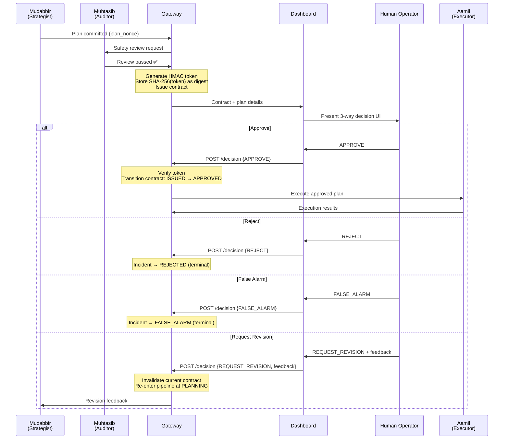
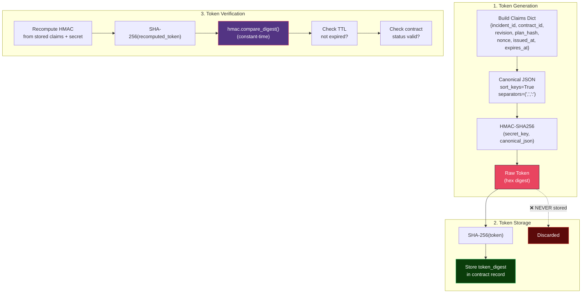
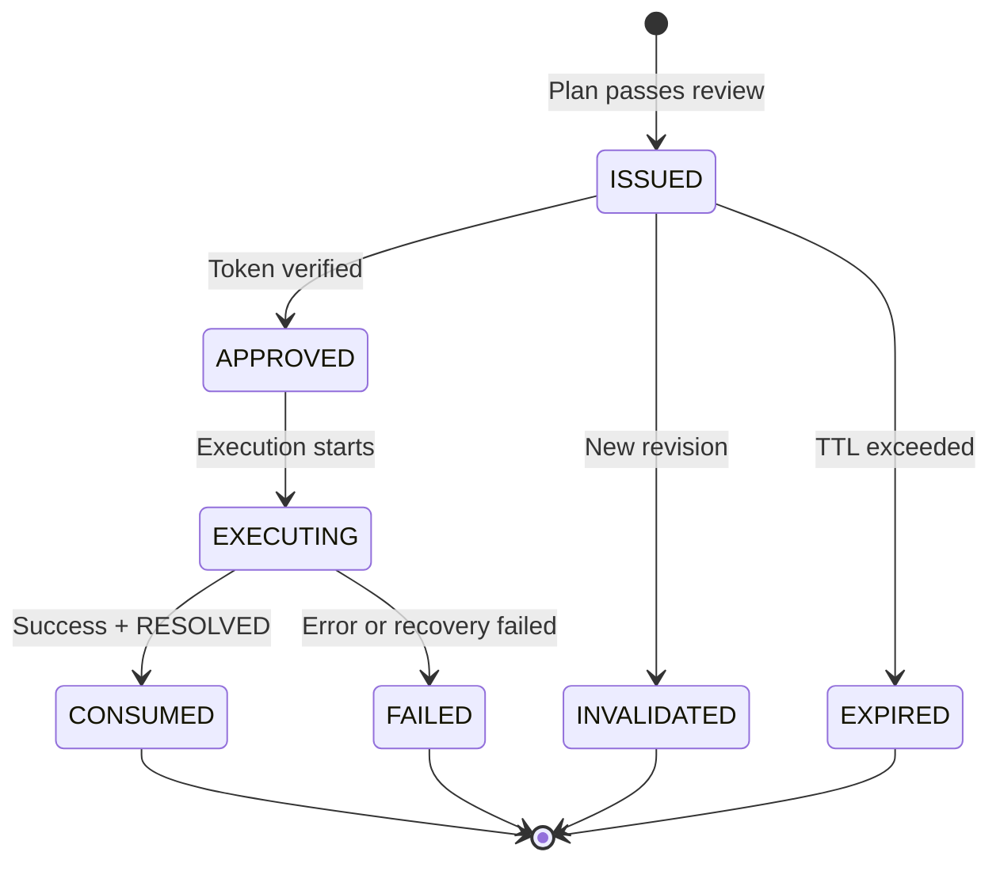
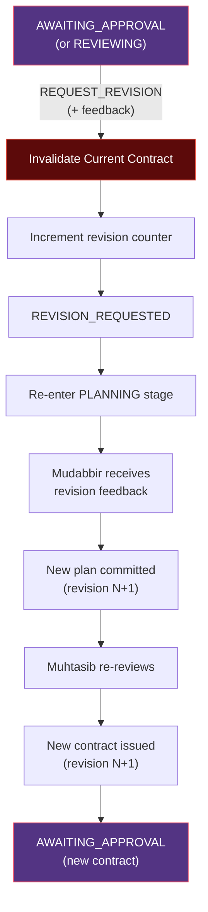

# MuhafizSRE — Approval Model

> Cryptographic human-in-the-loop governance for human-authorized remediation.

---

## 1. Overview

The approval model implements a **human-in-the-loop gate** with cryptographic integrity guarantees. After the agent pipeline produces a remediation plan and it passes safety review, a human operator must make a decision before any remediation actions are executed.

This design ensures:
- **Human oversight** — No autonomous action without explicit approval
- **Plan integrity** — The approved plan cannot be modified before execution
- **Audit trail** — Every decision is cryptographically linked in the hash chain
- **Token security** — Approval tokens use HMAC-SHA256 with timing-attack resistance

---

## 2. Three-Way Decision Gate

When a plan reaches `AWAITING_APPROVAL`, the human operator has **four choices**:

| Decision | Result | Terminal? |
|----------|--------|-----------|
| **APPROVE** | Accept the plan, authorize execution | No → proceeds to `EXECUTING` |
| **REJECT** | Deny the plan entirely | ✅ Yes → `REJECTED` |
| **FALSE_ALARM** | Mark the alert as a false positive | ✅ Yes → `FALSE_ALARM` |
| **REQUEST_REVISION** | Send feedback for plan improvement | No → re-enters `PLANNING` |

### Decision Flow



---

## 3. Approval Contract

When a plan passes safety review, the gateway issues an **ApprovalContract** — a cryptographic binding between the plan and the approval decision.

### Contract Fields

| Field | Type | Description |
|-------|------|-------------|
| `contract_id` | `str` (UUID-4) | Unique contract identifier |
| `incident_id` | `str` | Parent incident reference |
| `revision` | `int` | Plan revision number (starts at 1, increments on revision) |
| `plan_hash` | `str` | SHA-256 of canonical plan JSON |
| `plan_id` | `str` | Plan identifier from Mudabbir |
| `actions_json` | `str` | Serialized action envelopes — **frozen at contract time** |
| `approval_nonce` | `str` (UUID-4) | Random nonce for HMAC computation |
| `token_digest` | `str` | SHA-256 of HMAC-SHA256 token |
| `status` | `str` | Current lifecycle state (see §5) |
| `issued_at` | `str` | ISO-8601 creation timestamp |
| `expires_at` | `str` | ISO-8601 expiry timestamp |
| `approved_at` | `str?` | ISO-8601 approval timestamp |
| `execution_started_at` | `str?` | ISO-8601 execution start |
| `consumed_at` | `str?` | ISO-8601 consumption timestamp |

### Key Design Decisions

| Decision | Rationale |
|----------|-----------|
| **Freeze actions at issuance** | Prevents plan modification between review and execution |
| **Random nonce per contract** | Ensures unique HMAC even for identical plans |
| **Revision tracking** | Maintains full revision history for audit |
| **TTL enforcement** | Stale approvals expire, requiring re-review |

---

## 4. Cryptographic Token Flow

### Token Lifecycle



### Step-by-Step

#### Step 1: Token Generation (`gateway/security.py`)

```python
# Build canonical claims
claims = {
    "incident_id": incident_id,
    "contract_id": contract_id,
    "revision": revision,
    "plan_hash": plan_hash,
    "nonce": approval_nonce,
    "issued_at": issued_at,
    "expires_at": expires_at,
}

# Serialize to canonical JSON
canonical = json.dumps(claims, sort_keys=True, separators=(",", ":"))

# Compute HMAC-SHA256
token = hmac.new(
    secret_key.encode("utf-8"),
    canonical.encode("utf-8"),
    hashlib.sha256,
).hexdigest()
```

#### Step 2: Token Storage

```python
# Store ONLY the digest — NEVER the raw token
token_digest = hashlib.sha256(token.encode("utf-8")).hexdigest()
# → saved to approval_contracts.token_digest
```

#### Step 3: Token Verification

```python
# Recompute token from stored claims
recomputed_token = hmac.new(
    secret_key.encode("utf-8"),
    canonical.encode("utf-8"),
    hashlib.sha256,
).hexdigest()

# Compute digest of recomputed token
recomputed_digest = hashlib.sha256(
    recomputed_token.encode("utf-8")
).hexdigest()

# Constant-time comparison (prevents timing attacks)
is_valid = hmac.compare_digest(recomputed_digest, stored_token_digest)
```

---

## 5. Contract Lifecycle



---

## 6. Plan Hash Integrity

The `plan_hash` is a SHA-256 digest of the **canonical JSON representation** of the remediation plan. This provides:

| Guarantee | Description |
|-----------|-------------|
| **Integrity** | Plan cannot be modified after review |
| **Binding** | Contract is bound to a specific plan version |
| **Detection** | Any tampering produces a different hash |
| **Audit** | Hash is recorded in the event chain |

### Computation

```python
plan_json = json.dumps(plan_data, sort_keys=True, separators=(",", ":"))
plan_hash = hashlib.sha256(plan_json.encode("utf-8")).hexdigest()
```

---

## 7. Revision Flow

When a human requests a revision (or Muhtasib issues a safety challenge):



### Revision Properties

- Previous contracts remain in `INVALIDATED` state (preserved for audit)
- Each revision increments the `revision` counter on the incident
- Mudabbir receives the human feedback as context for the new plan
- The new contract has its own unique `contract_id` and `approval_nonce`

---

## 8. Security Invariants Checklist

| # | Invariant | Implementation |
|---|-----------|---------------|
| 1 | Raw HMAC token never stored | Only `SHA-256(token)` persisted as `token_digest` |
| 2 | Constant-time comparison | `hmac.compare_digest()` prevents timing attacks |
| 3 | Canonical JSON serialization | `sort_keys=True, separators=(',',':')` ensures deterministic ordering |
| 4 | TTL enforcement | Expired contracts cannot be approved |
| 5 | One-time use | Contract transitions to `CONSUMED` after successful execution |
| 6 | Plan hash binding | Contract bound to specific plan via SHA-256 hash |
| 7 | Actions frozen at issuance | `actions_json` immutable after contract creation |
| 8 | Secret from environment | `MUHAFIZ_APPROVAL_SECRET` loaded from env var, never hardcoded |
| 9 | Atomic transitions | Compare-and-set prevents race conditions |
| 10 | Revision invalidation | Old contracts `INVALIDATED` when new revision requested |

---

## 9. Configuration

| Setting | Source | Default | Description |
|---------|--------|---------|-------------|
| `approval_secret` | `MUHAFIZ_APPROVAL_SECRET` env var | None (required) | HMAC signing key |
| `token_ttl` | Settings class | Configurable | TTL in seconds for approval tokens |

---

## Production Hardening Roadmap

MuhafizSRE is a governed multi-agent SRE prototype with deterministic synthetic enterprise telemetry, real ADK agent workflows, HMAC-bound human approval contracts, and real local Docker sandbox remediation. For Fortune-500 production deployment, the next hardening steps are:

1. **Durable orchestration** — Move long-running agent workflows from FastAPI in-process background tasks to Temporal, Cloud Tasks, Celery, or Step Functions.
2. **Backpressure and rate limits** — Add tenant-level concurrency controls, LLM quota management, alert deduplication, priority queues, and budget ceilings.
3. **Production data plane** — Replace SQLite with Postgres/Cloud SQL, add row-level tenant isolation, and anchor terminal event seals to external append-only storage.
4. **Multi-tenant identity** — Add organization_id/workspace_id to incidents, contracts, events, and room messages. Enforce RBAC from authenticated JWT claims.
5. **Real infrastructure adapters** — Replace simulated enterprise skill adapters with parameterized Kubernetes, GCP, Secret Manager, PagerDuty, and ServiceNow integrations.
6. **Resumable execution** — Add idempotent action checkpoints, retry policies, compensation actions, and operator-controlled resume/reissue flows.

