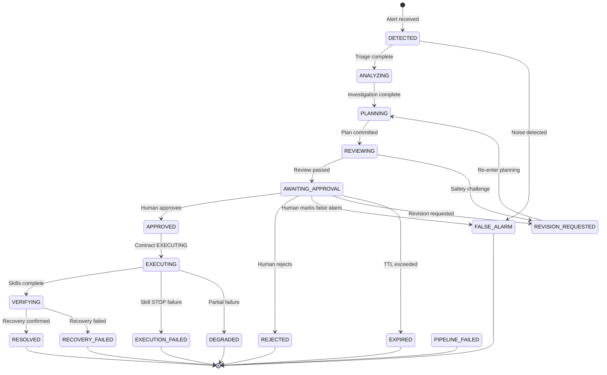
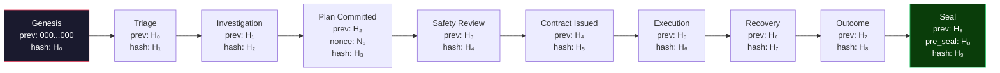
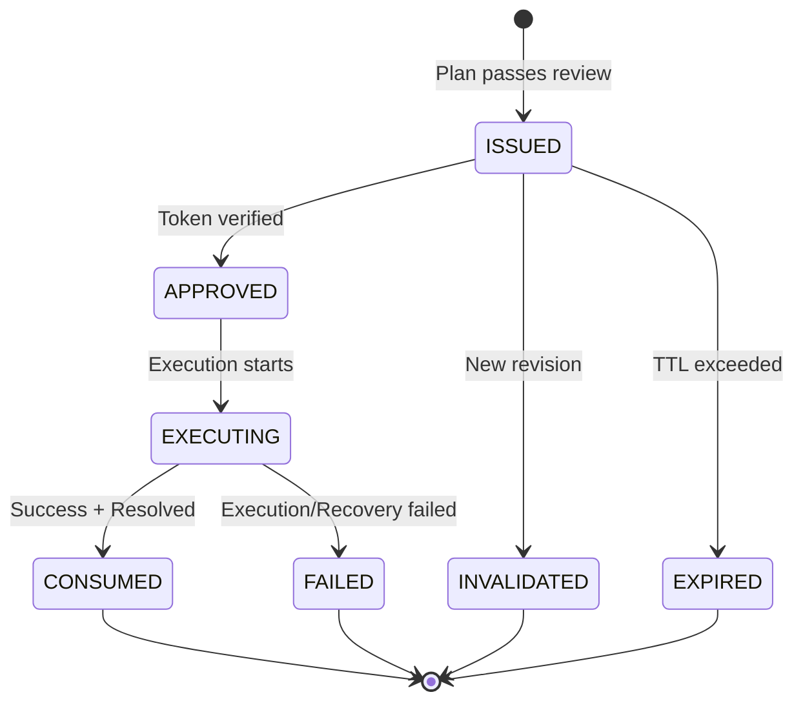
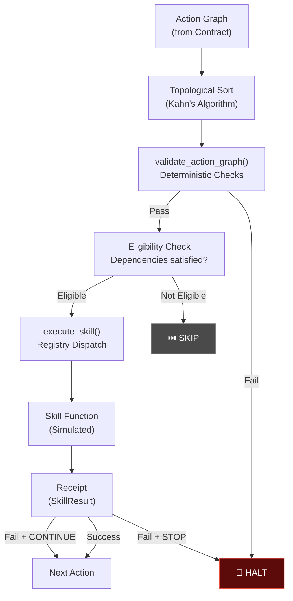
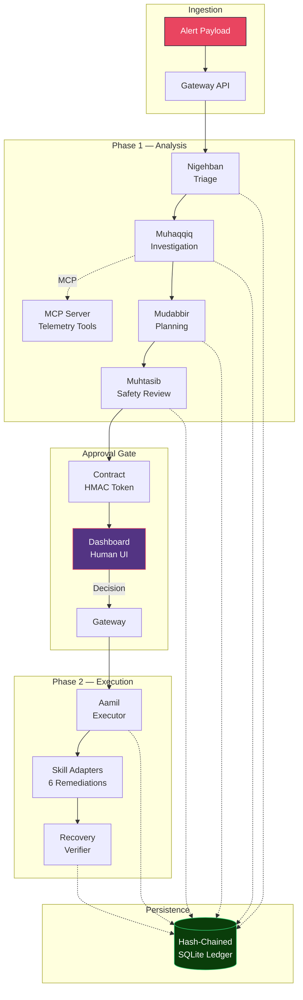

# MuhafizSRE — Architecture Document

> **محافظ** (Muhafiz) — *"Guardian"* in Urdu

---

## 1. System Overview

MuhafizSRE is a **human-governed multi-agent SRE prototype** that detects, diagnoses, and proposes remediation for incidents through a fleet of 5 specialized AI agents — the **Muhafiz Fleet** (محافظ فلیٹ).

The system is built on the following core principles:

| Principle | Implementation |
|-----------|---------------|
| **Specialization** | Each agent excels at one task (triage, diagnosis, planning, review, execution) |
| **Adversarial Safety** | Muhtasib (Auditor) challenges plans before execution |
| **Human Governance** | 3-way approval gate ensures human oversight |
| **Cryptographic Integrity** | SHA-256 hash-chained audit ledger — security controls inspired by enterprise change governance |
| **Deterministic Validation** | All actions pass typed schema validation before execution |

### Technology Stack

| Layer | Technology | Purpose |
|-------|-----------|---------|
| Agent Framework | Google ADK 2.x (gateway-orchestrated, explicitly routed ADK multi-agent workflow) | Multi-agent orchestration |
| LLM Backend | Gemini 3.1/3.5 (Flash Lite, Flash, Pro Preview — 3-tier cognitive architecture) | Agent reasoning |
| Tool Protocol | MCP (Model Context Protocol) | Telemetry tool server |
| Gateway | FastAPI + SSE + aiosqlite | API, streaming, persistence |
| Dashboard | Next.js | Human approval UI |
| Security | HMAC-SHA256 + SHA-256 hash chain | Token integrity + audit trail |

---

## 2. Agent Pipeline

The Muhafiz Fleet is a **5-stage routed pipeline** using ADK's agent orchestration (routed workflow / agent room). Each agent is an `LlmAgent` each assigned to one of three cognitive tiers (Speed, Analytical, Safety), with distinct temperature, tools, and persona. The gateway splits execution into **Phase 1** (Triage → Safety Review) and **Phase 2** (Execution → Verification), with a human approval gate in between.

### Agent Profiles

| # | Agent | Urdu | Title | Model | Temperature | Role |
|---|-------|------|-------|-------|-------------|------|
| 1 | **Nigehban** | نگہبان | The Watchman | `gemini-3.1-flash-lite` | 0.1 | Triage & severity classification |
| 2 | **Muhaqqiq** | محقق | The Investigator | `gemini-3-flash-preview` | default | Root cause diagnosis via MCP tools |
| 3 | **Mudabbir** | مدبر | The Strategist | `gemini-3-flash-preview` | default | Remediation planning & nonce generation |
| 4 | **Muhtasib** | محتسب | The Auditor | `gemini-3.1-pro-preview` | 0.1 | Adversarial safety review |
| 5 | **Aamil** | عامل | The Executor | `gemini-3.1-flash-lite` | 0.0 | Cryptographic verification & skill execution |

### Pipeline Flow

```mermaid
flowchart LR
    A[🚨 Alert Ingestion] --> B[نگہبان<br/>Nigehban<br/>Triage]
    B -->|P4/Transient| FA[🚫 FALSE_ALARM]
    B -->|P0-P3 Actionable| C[محقق<br/>Muhaqqiq<br/>Investigation]
    C --> D[مدبر<br/>Mudabbir<br/>Planning]
    D --> E[محتسب<br/>Muhtasib<br/>Safety Review]
    E -->|Challenge Issued| D
    E -->|Review Passed| F[🔐 Human Approval Gate]
    F -->|Approve| G[عامل<br/>Aamil<br/>Execution]
    F -->|Reject| RJ[❌ REJECTED]
    F -->|False Alarm| FA
    F -->|Revise| D
    G --> H[🔍 Recovery Verification]
    H -->|Score = 1.0| RS[✅ RESOLVED]
    H -->|Score < 1.0| RF[⚠️ RECOVERY_FAILED]
    G -->|Skill Error| EF[💥 EXECUTION_FAILED]

    style A fill:#1a1a2e,stroke:#e94560,color:#fff
    style B fill:#16213e,stroke:#0f3460,color:#fff
    style C fill:#16213e,stroke:#0f3460,color:#fff
    style D fill:#16213e,stroke:#0f3460,color:#fff
    style E fill:#16213e,stroke:#0f3460,color:#fff
    style F fill:#533483,stroke:#e94560,color:#fff
    style G fill:#16213e,stroke:#0f3460,color:#fff
    style H fill:#16213e,stroke:#0f3460,color:#fff
    style RS fill:#0a3d0a,stroke:#2ecc71,color:#fff
    style FA fill:#4a4a4a,stroke:#888,color:#fff
    style RJ fill:#5c0a0a,stroke:#e74c3c,color:#fff
    style RF fill:#5c3a0a,stroke:#f39c12,color:#fff
    style EF fill:#5c0a0a,stroke:#e74c3c,color:#fff
```



### Inter-Agent Communication

Agents communicate through ADK's **`session_state`** dictionary, injected via `ToolContext`. Each agent reads from predecessor keys and writes to its own key:

| Agent | Reads | Writes |
|-------|-------|--------|
| Nigehban | `alert` | `triage_result` |
| Muhaqqiq | `alert`, `triage_result` | `investigation_result` |
| Mudabbir | `alert`, `investigation_result` | `plan` |
| Muhtasib | `plan`, `investigation_result` | `safety_review` |
| Aamil | `execution_snapshot` (gateway-validated) | `execution_receipts`, `all_actions_succeeded` |

### Gateway Authority Invariant

> **Single Orchestration Model**: The gateway is the **sole orchestration authority**.
> All routing decisions are deterministic Python conditionals in gateway code.

The system deliberately avoids ADK's composite orchestrators (`LoopAgent`, `SequentialAgent`, `GroupAgent`). Each agent is a stateless `LlmAgent` instance invoked individually via ADK's `Runner.run_async()`. This design choice yields three properties that would be critical for a production SRE system:

| Property | Mechanism |
|----------|-----------|
| **Determinism** | Every routing branch (false alarm short-circuit, challenge routing, escalation) is a gateway `if/elif` — never an LLM decision |
| **Traceability** | The event hash chain records exactly which agent ran, in which order, with which inputs — reviewable from the ledger alone |
| **Single Authority Boundary** | The gateway owns all authorization gates: contract issuance, atomic approval claiming (`claim_approval`), execution snapshot validation (`claim_execution_snapshot`), and recovery verification |

**Aamil (Phase 2) Trust Flow**: The gateway validates the contract via `claim_execution_snapshot()` — which recomputes the canonical plan hash, verifies HMAC-bound claims, and confirms actions_json consistency — then injects the **immutable execution snapshot** directly into Aamil's session state. Aamil reads `snapshot["actions"]` from session state only. It **never** fetches the contract from the database independently. The gateway is the sole authority for what actions may execute.

**Runtime Enforcement**: The `AGENT_REGISTRY` in `agents/agent.py` includes an import-time assertion that every registered agent is an `LlmAgent` instance — any accidental introduction of a composite orchestrator causes an immediate `AssertionError`.

---

## 3. Incident State Machine

The incident progresses through **19 possible states** defined by the `IncidentStatus` enum:



---

## 4. Gateway Service

The **FastAPI gateway** (`gateway/app.py`) serves as the central coordination point, exposing RESTful APIs and SSE streams.

### API Routes

| Method | Endpoint | Purpose |
|--------|----------|---------|
| `POST` | `/api/incidents` | Create incident from alert payload |
| `GET` | `/api/incidents/{id}` | Retrieve incident details |
| `POST` | `/api/incidents/{id}/decision` | Human 3-way decision (approve/reject/false alarm/revise) |
| `GET` | `/api/incidents/{id}/events` | Event timeline |
| `GET` | `/api/incidents/{id}/contract` | Active approval contract |
| `POST` | `/api/incidents/{id}/approve` | Direct approval endpoint |
| `GET` | `/api/incidents/{id}/chain/verify` | Verify hash chain integrity |
| `GET` | `/api/incidents/{id}/stream` | SSE real-time event stream |
| `GET` | `/health` | Liveness probe |

### Persistence Layer

- **Database**: SQLite via `aiosqlite` with `PRAGMA foreign_keys=ON`
- **Concurrency**: Single writer lock (`asyncio.Lock`) for ACID atomicity
- **Tables**: `incidents`, `events`, `approval_contracts`, `pipeline_runs`
- **Transactions**: All state mutations use `BEGIN IMMEDIATE` for serializable isolation

### Two-Phase Pipeline Execution

The gateway orchestrates two background task phases:

1. **Phase 1** — `_run_phase1_pipeline()`: Triage → Investigation → Planning → Safety Review → Contract Issuance
2. **Phase 2** — `_run_phase2_execution()`: Action Execution → Recovery Verification → Finalization

Both phases run as FastAPI `BackgroundTask` instances, with progress streamed via SSE. The two-phase split enables asynchronous human-in-the-loop governance — Phase 1 completes and pauses at the approval gate, and Phase 2 only begins after the human decision is received.

---

## 5. Hash-Chained Event Ledger

Every action in the system is recorded in an **append-only, hash-chained audit ledger** designed with security controls inspired by enterprise change governance disciplines.

### Hash Computation

```
envelope = {"schema_version": ..., "incident_id": ..., "run_id": ...,
            "sequence": ..., "actor": ..., "actor_role": ...,
            "event_type": ..., "summary": ..., "payload_json": ...,
            "previous_hash": ..., "created_at": ...}
event_hash = SHA-256(canonical_json(envelope)).hexdigest()
```

### Chain Structure



### Integrity Properties

| Property | Mechanism |
|----------|-----------|
| **Tamper Detection** | Any modification to a historical event breaks the chain |
| **Completeness** | Every state transition generates an event |
| **Ordering** | Monotonically increasing `sequence` per incident |
| **Finality** | Seal event with `pre_seal_head_hash` marks chain closure |
| **Verification** | `verify_chain()` recomputes all hashes and compares |

---

## 6. Approval Contract Model

The approval contract is a **cryptographic binding** between a remediation plan and a human approval decision.

### Contract Lifecycle



### Cryptographic Token Flow

1. **Generation**: `HMAC-SHA256(secret_key, canonical_json_claims)`
2. **Storage**: Only `SHA-256(token)` stored as `token_digest` — raw token never persisted
3. **Verification**: Recompute HMAC → SHA-256 → `hmac.compare_digest()` (constant-time)

### Claims Structure

```json
{
  "incident_id": "INC-001",
  "contract_id": "uuid-4",
  "revision": 1,
  "plan_hash": "sha256-of-plan",
  "nonce": "uuid-4",
  "issued_at": "2026-06-20T12:00:00Z",
  "expires_at": "2026-06-20T13:00:00Z"
}
```

---

## 7. Skill Adapter Layer

The system provides **6 remediation skills** packaged as async functions with typed parameters and structured return values.

### Skill Catalogue

| Skill | Target | Required Parameters | Simulated Command |
|-------|--------|--------------------|----|
| `rollback_service_revision` | Cloud Run | `service_name`, `target_revision` | `gcloud run services update-traffic` |
| `apply_rate_limit` | API Gateway | `service_name`, `requests_per_second`, `duration_seconds` | `gcloud api-gateway rate-limit set` |
| `scale_service` | Cloud Run / K8s | `service_name`, `replicas` | `gcloud run services update --min/max-instances` |
| `flush_cache` | Redis | `service_name`, `cache_type` | `redis-cli FLUSHDB` |
| `rotate_credentials` | Secret Manager | `service_name`, `credential_type` | `gcloud secrets versions add` |
| `restart_service` | Kubernetes | `service_name`, `graceful` | `kubectl rollout restart` |

### Execution Architecture



### Action Validation (Deterministic)

All actions pass through `shared/action_policy.py` validation:

- **Skill allowlist**: Only 6 enumerated skills
- **Target allowlist**: `auth-service`, `payment-gateway`, `user-service`
- **Forbidden operations**: `delete_database`, `drop_table`, `exfiltrate_secret`, `rm_rf`, `format_disk`, `shutdown_cluster`, etc.
- **Argument safety**: Shell metachar (`|;&$`), URL, path traversal (`../`), command injection regex detection
- **Typed schemas**: Pydantic models enforce parameter types and bounds
- **Dependency graph**: Acyclic validation via Kahn's algorithm

---

## 8. MCP Telemetry Integration

**Muhaqqiq** (Investigator) connects to a **FastMCP server** for enterprise telemetry access.

### MCP Tools

| Tool | Purpose | Returns |
|------|---------|---------|
| `get_cloud_logging_traces` | Query GCP Cloud Logging | Log entries with timestamps, severity, messages |
| `get_github_deployments` | CI/CD deployment history | Recent deployments with SHAs, status, timestamps |
| `get_system_metrics` | Infrastructure metrics | Time-series CPU, memory, error rate, latency |

### Connection Architecture

```
Muhaqqiq (LlmAgent)
    └── MCPToolset
         └── StdioConnectionParams
              └── python shared/mcp_server/server.py
```

The MCP server runs as a subprocess, communicating via stdin/stdout. Tool filters ensure Muhaqqiq can only access the 3 registered telemetry tools.

---

## 9. Recovery Verification

After remediation execution, the system performs **8 subsystem health checks** to verify recovery.

### Subsystem Checks

| Check | Description | Simulated Latency |
|-------|-------------|-------------------|
| `api_reachability` | API endpoint health | 45.2ms |
| `db_connectivity` | Database connection pool | 12.8ms |
| `cache_health` | Redis/Memcached status | 3.1ms |
| `dns_resolution` | DNS lookup latency | 8.4ms |
| `tls_validity` | TLS certificate status | 22.6ms |
| `lb_backends` | Load balancer backends | 15.3ms |
| `error_rate` | Error rate baseline | 120.5ms |
| `p99_latency` | P99 latency baseline | 95.0ms |

### Scoring

| Score | Status | Meaning |
|-------|--------|---------|
| 1.0 | `RECOVERED` | All checks passed |
| ≥ 0.5 | `PARTIAL` | Some checks failed |
| < 0.5 | `FAILED` | Majority of checks failed |

When a `victim_url` is provided, the `api_reachability` check performs a **real HTTP GET** via `httpx.AsyncClient`. All other checks remain simulated.

---

## 10. Dashboard

The **Next.js dashboard** provides a human-facing interface for the approval workflow.

### Features

- **Real-time Timeline**: SSE-powered live event stream
- **3-Way Approval Gate**: Approve / Reject / False Alarm buttons
- **Revision Request**: Feedback form for plan revision
- **Agent Avatars**: Imagen-generated avatars for each agent
- **Pipeline Visualization**: Stage-by-stage progress indicator

---

## 11. Deployment Architecture

### Docker

- **Multi-stage Dockerfile**: Builder stage (compile deps) → Runtime stage (minimal image)
- **Non-root execution**: Dedicated `muhafiz` user with no shell (`/sbin/nologin`)
- **Health check**: `HEALTHCHECK` against `/health` endpoint

### Cloud Run

- **Cloud Build**: `cloudbuild.yaml` with Secret Manager integration
- **Secrets**: `gemini-api-key` and `muhafiz-secret-key` via Secret Manager
- **Port**: 8000 (configurable via `MUHAFIZ_PORT`)

### Environment Variables

| Variable | Required | Description |
|----------|----------|-------------|
| `GEMINI_API_KEY` | ✅ | Gemini API key |
| `MUHAFIZ_APPROVAL_SECRET` | ✅ | HMAC signing key |
| `MUHAFIZ_DEFAULT_MODEL` | ❌ | Optional fallback for tiers not explicitly configured (default: `gemini-3.1-flash-lite`) |
| `MUHAFIZ_SPEED_MODEL` | ❌ | Model for triage/execution (default: gemini-3.1-flash-lite) |
| `MUHAFIZ_ANALYTICAL_MODEL` | ❌ | Model for diagnosis/planning (default: gemini-3-flash-preview) |
| `MUHAFIZ_SAFETY_MODEL` | ❌ | Model for safety review (default: gemini-3.1-pro-preview) |

---

## 12. Data Flow Summary



---

## Production Hardening Roadmap

MuhafizSRE is a governed multi-agent SRE prototype with deterministic synthetic enterprise telemetry, real ADK agent workflows, HMAC-bound human approval contracts, and real local Docker sandbox remediation. For Fortune-500 production deployment, the next hardening steps are:

1. **Durable orchestration** — Move long-running agent workflows from FastAPI in-process background tasks to Temporal, Cloud Tasks, Celery, or Step Functions.
2. **Backpressure and rate limits** — Add tenant-level concurrency controls, LLM quota management, alert deduplication, priority queues, and budget ceilings.
3. **Production data plane** — Replace SQLite with Postgres/Cloud SQL, add row-level tenant isolation, and anchor terminal event seals to external append-only storage.
4. **Multi-tenant identity** — Add organization_id/workspace_id to incidents, contracts, events, and room messages. Enforce RBAC from authenticated JWT claims.
5. **Real infrastructure adapters** — Replace simulated enterprise skill adapters with parameterized Kubernetes, GCP, Secret Manager, PagerDuty, and ServiceNow integrations.
6. **Resumable execution** — Add idempotent action checkpoints, retry policies, compensation actions, and operator-controlled resume/reissue flows.

