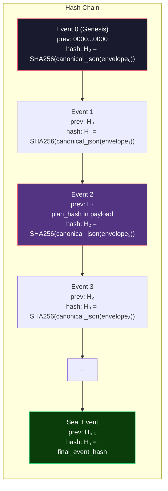

# MuhafizSRE — Event Schema Reference

> Every action in MuhafizSRE is recorded as an immutable event in the hash-chained audit ledger.

---

## 1. Event Table Schema

All events are stored in the `events` SQLite table:

| Column | Type | Constraints | Description |
|--------|------|-------------|-------------|
| `id` | `INTEGER` | `PRIMARY KEY AUTOINCREMENT` | Auto-incrementing row ID |
| `incident_id` | `TEXT` | `NOT NULL`, FK → `incidents` | Parent incident |
| `run_id` | `TEXT` | `NOT NULL` | Pipeline run that produced this event |
| `sequence` | `INTEGER` | `NOT NULL` | Monotonically increasing per incident |
| `actor` | `TEXT` | `NOT NULL` | Agent name, `system`, `gateway`, or `operator` |
| `actor_role` | `TEXT` | `NOT NULL` | Role identifier (see roles table) |
| `event_type` | `TEXT` | `NOT NULL` | Event type identifier |
| `summary` | `TEXT` | `NOT NULL` | Human-readable summary |
| `payload_json` | `TEXT` | `NOT NULL` | JSON-serialized payload |
| `schema_version` | `INTEGER` | `NOT NULL` | Schema version for forward compatibility |
| `event_hash` | `TEXT` | `NOT NULL` | SHA-256 hash linking to previous event |
| `previous_hash` | `TEXT` | `NOT NULL` | Hash of previous event (or genesis) |
| `created_at` | `TEXT` | `NOT NULL` | ISO-8601 UTC timestamp |

### Actor Roles

| Actor | Role | Agent |
|-------|------|-------|
| `nigehban` | `triage` / `watchman` | Nigehban (Triage) |
| `muhaqqiq` | `investigator` | Muhaqqiq (Diagnosis) |
| `mudabbir` | `commander` | Mudabbir (Planning) |
| `muhtasib` | `safety_reviewer` | Muhtasib (Safety Review) |
| `aamil` | `executor` | Aamil (Execution) |
| `system` | `gateway` | Gateway infrastructure |
| `system` | `verifier` | Recovery verifier |
| `operator` | `human` | Human operator |

---

## 2. Event Chain Architecture

```mermaid
flowchart LR
    subgraph "Phase 1 — Analysis"
        E1["①<br/>triage_completed<br/>seq: 1"] --> E2["②<br/>investigation_completed<br/>seq: 2"]
        E2 --> E3["③<br/>plan_created<br/>seq: 3<br/>🔒 plan_hash in payload"]
        E3 --> E4["④<br/>safety_review_completed<br/>seq: 4"]
        E4 --> E5["⑤<br/>contract_issued<br/>seq: 5"]
    end

    subgraph "Human Gate"
        E5 --> E6["⑥<br/>human_approved<br/>seq: 6"]
    end

    subgraph "Phase 2 — Execution"
        E6 --> E7["⑦<br/>plan_validated<br/>seq: 7"]
        E7 --> E8["⑧<br/>skill_executed<br/>seq: 8..N"]
        E8 --> E9["⑨<br/>actions_executed<br/>seq: N+1"]
        E9 --> E10["⑩<br/>recovery_verified<br/>seq: N+2"]
    end

    subgraph "Finalization"
        E10 --> E11["⑪<br/>outcome<br/>seq: N+3"]
        E11 --> E12["⑫<br/>seal<br/>seq: N+4<br/>🔒 Chain sealed"]
    end

    style E1 fill:#16213e,stroke:#0f3460,color:#fff
    style E3 fill:#533483,stroke:#e94560,color:#fff
    style E6 fill:#533483,stroke:#e94560,color:#fff
    style E12 fill:#0a3d0a,stroke:#2ecc71,color:#fff
```



---

## 3. Event Types Catalogue

### 3.1 `triage_completed`

**Actor**: `nigehban` / `watchman`

Emitted when Nigehban completes alert triage and severity classification.

| Payload Field | Type | Description |
|---------------|------|-------------|
| `severity` | `str` | Classified severity (`P0`–`P4`) |
| `classification` | `str` | Incident classification |
| `is_actionable` | `bool` | Whether the alert requires action |
| `is_false_alarm` | `bool` | Whether the alert is noise |
| `triage_reasoning` | `str` | Explanation of triage decision |

---

### 3.2 `investigation_completed`

**Actor**: `muhaqqiq` / `investigator`

Emitted when Muhaqqiq finishes root cause analysis using MCP telemetry tools.

| Payload Field | Type | Description |
|---------------|------|-------------|
| `root_cause_code` | `str` | One of 10 `RootCauseCode` enum values |
| `root_cause_description` | `str` | Detailed explanation |
| `evidence` | `list[dict]` | Supporting evidence from tool calls |
| `tool_calls_made` | `list[str]` | MCP tools invoked during investigation |
| `confidence` | `float` | Confidence level (0.0–1.0) |

**Valid Root Cause Codes**: `BAD_DEPLOYMENT`, `CONFIG_DRIFT`, `CACHE_STAMPEDE`, `RESOURCE_EXHAUSTION`, `EXPIRED_CREDENTIAL`, `DNS_FAILURE`, `DEPENDENCY_OUTAGE`, `RATE_LIMIT_HIT`, `FALSE_POSITIVE`, `TELEMETRY_FAILURE`

---

### 3.3 `plan_created`

**Actor**: `mudabbir` / `commander`

Emitted when Mudabbir commits a remediation plan. The `plan_hash` (SHA-256 of the canonical plan JSON) is stored in the event payload and later verified at execution time.

| Payload Field | Type | Description |
|---------------|------|-------------|
| `plan` | `dict` | Full plan object (plan_id, revision, actions, strategy) |
| `plan_hash` | `str` | SHA-256 of canonical plan JSON (verified before execution) |
| `action_count` | `int` | Number of actions in the plan |

**ActionEnvelope Structure**:

| Field | Type | Description |
|-------|------|-------------|
| `action_id` | `str` | Unique action identifier |
| `skill` | `str` | One of 6 `AllowedSkill` values |
| `target` | `str` | Target service (`auth-service`, etc.) |
| `arguments` | `dict` | Typed arguments for the skill |
| `depends_on` | `list[str]` | Action IDs this depends on |
| `on_failure` | `str` | `STOP` or `CONTINUE` |
| `rationale` | `str` | Why this action is needed |

---

### 3.4 `safety_review_completed`

**Actor**: `muhtasib` / `safety_reviewer`

Emitted by the gateway when Muhtasib's bounded retry loop is exhausted (forced escalation). Uses the same verdict payload structure as `verdict_issued`.

| Payload Field | Type | Description |
|---------------|------|-------------|
| `decision` | `str` | Always `ESCALATE` (forced verdict finalizer) |
| `risk_score` | `float` | Risk assessment 0.0–1.0 |
| `reasoning` | `str` | Explanation of the escalation |
| `policy_findings` | `list[str]` | Action policy violations found |
| `challenge` | `str?` | Challenge description (if any) |
| `challenge_target` | `str?` | `EVIDENCE` or `PLAN` (if any) |
| `first_pass_commit` | `bool` | Always `false` (retry path) |
| `retry_used` | `bool` | Always `true` |

---

### 3.5 `verdict_issued`

**Actor**: `muhtasib` / `safety_reviewer`

Emitted when Muhtasib issues a safety verdict on the proposed plan. The `decision` field determines the pipeline branch.

| Payload Field | Type | Description |
|---------------|------|-------------|
| `decision` | `str` | `APPROVED_REQUIRES_HUMAN`, `CHALLENGE`, `BLOCKED_UNSAFE`, or `ESCALATE` |
| `risk_score` | `float` | Risk assessment 0.0–1.0 |
| `reasoning` | `str` | Explanation of the verdict |
| `policy_findings` | `list[str]` | Action policy violations found |
| `challenge` | `str?` | Challenge description (when decision is `CHALLENGE`) |
| `challenge_target` | `str?` | `EVIDENCE` or `PLAN` (when decision is `CHALLENGE`) |
| `first_pass_commit` | `bool` | Whether this was the first review pass |
| `retry_used` | `bool` | Whether a Muhtasib retry was used |

---

### 3.6 `contract_issued`

**Actor**: `gateway`

Emitted when the gateway issues an approval contract for a reviewed plan.

| Payload Field | Type | Description |
|---------------|------|-------------|
| `contract_id` | `str` | UUID-4 contract identifier |
| `revision` | `int` | Plan revision number |
| `plan_id` | `str` | Associated plan identifier |
| `plan_hash` | `str` | SHA-256 of canonical plan JSON |
| `expires_at` | `str` | ISO-8601 expiry timestamp |

---

### 3.7 `skill_executed`

**Actor**: `aamil` / `executor`

Emitted for each individual skill execution within the action graph. Multiple `skill_executed` events may be emitted per incident.

| Payload Field | Type | Description |
|---------------|------|-------------|
| `action_id` | `str` | Action envelope identifier |
| `skill` | `str` | Skill name executed |
| `target` | `str` | Target service |
| `receipt` | `dict` | Full `SkillResult` receipt |

**SkillResult Receipt Fields**:

| Field | Type | Description |
|-------|------|-------------|
| `status` | `str` | `success` or `error` |
| `execution_id` | `str` | 8-char hex trace ID |
| `timestamp` | `str` | ISO-8601 UTC |
| `service` | `str` | Target service name |
| `adapter` | `str` | `simulated` or `sandbox` |
| `detail` | `dict` | Skill-specific details |

---

### 3.8 `actions_executed`

**Actor**: `aamil` / `executor`

Emitted after all actions in the plan have been processed (replaces the entire action graph result).

| Payload Field | Type | Description |
|---------------|------|-------------|
| `receipts` | `dict[str, dict]` | Map of action_id → SkillResult receipt |
| `all_succeeded` | `bool` | Whether every action succeeded |
| `contract_id` | `str` | Associated contract identifier |

---

### 3.9 `recovery_verified`

**Actor**: `system` / `verifier`

Emitted after post-remediation health checks complete.

| Payload Field | Type | Description |
|---------------|------|-------------|
| `status` | `str` | `RECOVERED`, `PARTIAL`, or `FAILED` |
| `recovery_score` | `float` | Score 0.0–1.0 (passed/total) |
| `checks_passed` | `int` | Number of healthy checks |
| `checks_total` | `int` | Total checks run (8) |
| `service_id` | `str` | Verified service identifier |
| `checks` | `list[dict]` | Per-check results |
| `timestamp` | `str` | ISO-8601 verification time |

**Per-Check Result Fields**:

| Field | Type | Description |
|-------|------|-------------|
| `name` | `str` | Check name (e.g., `api_reachability`) |
| `description` | `str` | Human-readable description |
| `status` | `str` | `healthy` or `unhealthy` |
| `latency_ms` | `float` | Check latency in milliseconds |
| `service_id` | `str` | Target service |

---

### 3.10 `outcome`

**Actor**: `system` / `gateway`

Emitted during atomic finalization with the final incident status and reconciliation data.

| Payload Field | Type | Description |
|---------------|------|-------------|
| `final_status` | `str` | `RESOLVED`, `EXECUTION_FAILED`, or `RECOVERY_FAILED` |
| `reconciliation` | `dict` | Full reconciliation from `execute_action_graph` |
| `recovery` | `dict` | Full recovery report from `verify_recovery` |
| `contract_id` | `str` | Associated contract |
| `revision` | `int` | Plan revision |

---

### 3.11 `seal`

**Actor**: `system` / `gateway`

Emitted as the final event in the chain, marking the incident audit as sealed.

| Payload Field | Type | Description |
|---------------|------|-------------|
| `pre_seal_head_hash` | `str` | Hash of the outcome event (chain head before seal) |
| `record_count` | `int` | Total events in the chain (before seal) |
| `contract_id` | `str` | Associated contract |
| `revision` | `int` | Plan revision |
| `final_status` | `str` | Terminal incident status |

> **Note**: The seal event's own `event_hash` becomes the `final_event_hash` stored on the incident record.

---

### 3.12 `pipeline_failed`

**Actor**: `system` / `gateway`

Emitted when an unhandled exception occurs during pipeline execution.

| Payload Field | Type | Description |
|---------------|------|-------------|
| `phase` | `str` | `phase1` or `phase2` |
| `error_type` | `str` | Exception class name |
| `error_message` | `str` | Error description |

---

### 3.13 `human_approved`

**Actor**: `operator` / `human`

Emitted when a human operator approves the plan for execution.

| Payload Field | Type | Description |
|---------------|------|-------------|
| `action` | `str` | `APPROVE` |
| `contract_id` | `str` | Contract being approved |
| `revision` | `int` | Plan revision number |
| `operator` | `str` | Operator label |
| `feedback` | `str?` | Optional feedback text |

---

### 3.14 `human_rejected`

**Actor**: `operator` / `human`

Emitted when a human operator rejects the remediation plan.

| Payload Field | Type | Description |
|---------------|------|-------------|
| `action` | `str` | `REJECT` |
| `contract_id` | `str` | Contract being rejected |
| `revision` | `int` | Plan revision number |
| `operator` | `str` | Operator label |
| `feedback` | `str?` | Optional feedback text |

---

### 3.15 `revision_requested`

**Actor**: `operator` / `human`

Emitted when a human operator requests a plan revision. Triggers a new pipeline revision run.

| Payload Field | Type | Description |
|---------------|------|-------------|
| `action` | `str` | `REQUEST_REVISION` |
| `contract_id` | `str` | Contract identifier |
| `revision` | `int` | Plan revision number |
| `operator` | `str` | Operator label |
| `feedback` | `str?` | Revision feedback (passed to Mudabbir) |

---

### 3.16 `human_false_alarm`

**Actor**: `operator` / `human`

Emitted when a human operator marks the incident as a false alarm.

| Payload Field | Type | Description |
|---------------|------|-------------|
| `action` | `str` | `MARK_FALSE_ALARM` |
| `contract_id` | `str` | Contract identifier |
| `revision` | `int` | Plan revision number |
| `operator` | `str` | Operator label |
| `feedback` | `str?` | Optional feedback text |

---

### 3.17 Additional Event Types

The following event types are also emitted by the pipeline but have simpler payloads:

| Event Type | Actor | Description | Key Payload Fields |
|------------|-------|-------------|-------------------|
| `incident_created` | `gateway` | First event in chain when alert arrives | Alert object (summary, severity, service_id) |
| `plan_validated` | `gateway` / `system` | Pre-execution plan hash revalidation passed | `contract_id`, `stored_plan_hash`, `recomputed_plan_hash` |
| `plan_tampered` | `gateway` / `system` | Pre-execution revalidation failed (hash mismatch) | `reason`, `contract_id` |
| `false_alarm_detected` | `nigehban` / `watchman` | Triage classified alert as non-actionable | Same as triage payload |
| `challenge_limit_reached` | `gateway` / `system` | Max Muhtasib challenge rounds exceeded → escalation | `challenges_used`, `max_rounds` |
| `agent_usage_telemetry` | agent / `system` | LLM token usage per agent invocation | `agent`, `total_tokens`, `prompt_tokens`, `candidates_tokens` |

---

## 4. Hash Chain Algorithm

### Computation Formula

```python
envelope = {
    "schema_version": SCHEMA_VERSION, "incident_id": incident_id,
    "run_id": run_id, "sequence": sequence, "actor": actor,
    "actor_role": actor_role, "event_type": event_type,
    "summary": summary, "payload_json": payload_json,
    "previous_hash": previous_hash, "created_at": now,
}
event_hash = sha256_hex(envelope)  # SHA-256 of canonical_json(envelope)
```

### Hash Chain Properties

| Property | Value |
|----------|-------|
| **Algorithm** | SHA-256 (64-char hex digest) |
| **Genesis** | `previous_hash = '0' * 64` (64 zeros) |
| **Envelope** | JSON dict with 11 fields (schema_version, incident_id, run_id, sequence, actor, actor_role, event_type, summary, payload_json, previous_hash, created_at) |
| **Canonicalization** | `json.dumps(envelope, sort_keys=True, separators=(',', ':'))` |

### Chain Visualization



### Chain Verification

The `verify_chain()` method in `gateway/store.py`:

1. Retrieves all events for an incident ordered by `sequence`
2. Starting from genesis (`previous_hash = '0' * 64`)
3. For each event, recomputes the hash using the formula above
4. Compares the recomputed hash with the stored `event_hash`
5. Returns `True` if all hashes match, `False` if any mismatch

```python
def verify_chain(events: list[dict]) -> bool:
    expected_prev = "0" * 64
    for event in events:
        envelope = {
            "schema_version": event["schema_version"],
            "incident_id": event["incident_id"],
            "run_id": event["run_id"],
            "sequence": event["sequence"],
            "actor": event["actor"],
            "actor_role": event["actor_role"],
            "event_type": event["event_type"],
            "summary": event["summary"],
            "payload_json": event["payload_json"],
            "previous_hash": expected_prev,
            "created_at": event["created_at"],
        }
        computed = sha256_hex(envelope)
        if computed != event["event_hash"]:
            return False
        expected_prev = computed
    return True
```

---

## 5. Event Ordering

### Sequence Assignment

- Each event within an incident has a **monotonically increasing `sequence` number**
- Sequence is computed as `MAX(sequence) + 1` within the incident at write time
- The first event in an incident has `sequence = 1`

### Ordering Guarantees

| Guarantee | Mechanism |
|-----------|-----------|
| **Monotonic sequences** | `MAX(sequence) + 1` computed within transaction |
| **No gaps** | Writer lock prevents concurrent inserts |
| **Causal ordering** | Gateway-orchestrated pipeline ensures causal consistency |
| **Tamper detection** | Hash chain detects reordering or insertion |

### Write Serialization

All event writes are serialized through:

1. **`asyncio.Lock`** (writer lock) — prevents concurrent Python writes
2. **`BEGIN IMMEDIATE`** — SQLite transaction isolation
3. **`_append_event_within_tx()`** — internal method for transactional event append

This ensures that even in an async context, events are appended atomically and in strict order.
