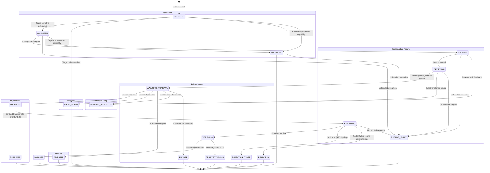
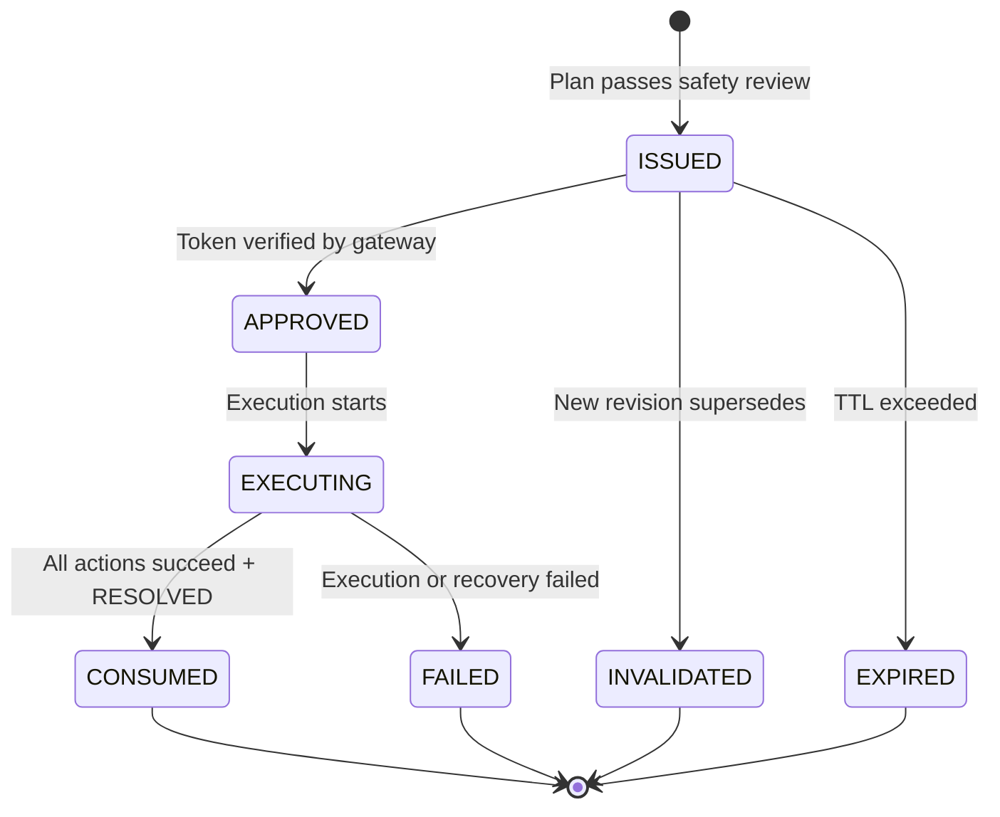
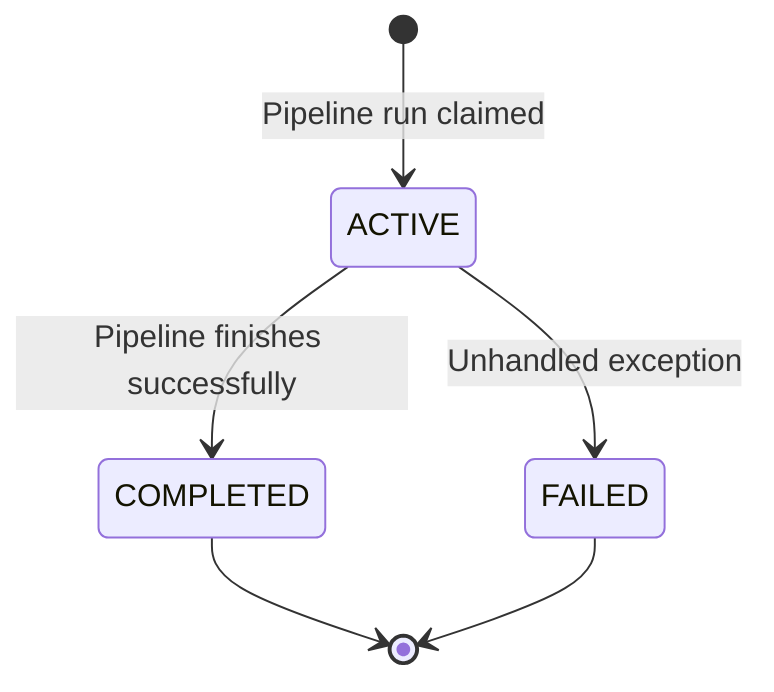

# MuhafizSRE — State Machine Reference

> All state machines use **atomic compare-and-set transitions** — the `from_status` is checked before the `to_status` is applied, preventing race conditions.

---

## 1. Incident Lifecycle State Machine

The `IncidentStatus` enum defines **19 states** covering the full incident lifecycle from detection through resolution or failure.

### State Diagram



### State Definitions

| State | Description | Terminal? |
|-------|-------------|-----------|
| `DETECTED` | Alert received, incident created | No |
| `ANALYZING` | Muhaqqiq investigating root cause | No |
| `PLANNING` | Mudabbir creating remediation plan | No |
| `REVIEWING` | Muhtasib performing safety review | No |
| `AWAITING_APPROVAL` | Plan presented to human for decision | No |
| `APPROVED` | Human approved the plan | No |
| `EXECUTING` | Aamil executing remediation actions | No |
| `VERIFYING` | Recovery verification in progress | No |
| `RESOLVED` | Successfully remediated and verified | ✅ Yes |
| `FALSE_ALARM` | Alert determined to be noise | ✅ Yes |
| `BLOCKED` | Pipeline blocked (dependency failure) | ✅ Yes |
| `ESCALATED` | Escalated to human (beyond capability) | ✅ Yes |
| `REJECTED` | Human rejected the remediation plan | ✅ Yes |
| `EXPIRED` | Approval contract TTL exceeded | ✅ Yes |
| `REVISION_REQUESTED` | Human requested plan revision | No |
| `EXECUTION_FAILED` | Skill execution failed (STOP policy) | ✅ Yes |
| `RECOVERY_FAILED` | Execution succeeded but recovery failed | ✅ Yes |
| `PIPELINE_FAILED` | Infrastructure/pipeline error | ✅ Yes |
| `DEGRADED` | Partial remediation success (some actions failed, service partially recovered) | ✅ Yes |

### Transition Table

| # | Source | Target | Trigger | Agent/Actor |
|---|--------|--------|---------|-------------|
| 1 | `DETECTED` | `ANALYZING` | Triage complete, alert is actionable | Nigehban |
| 2 | `DETECTED` | `FALSE_ALARM` | Triage determines noise (P4/transient) | Nigehban |
| 3 | `DETECTED` | `ESCALATED` | Beyond autonomous capability | Nigehban |
| 4 | `DETECTED` | `PIPELINE_FAILED` | Unhandled exception | System |
| 5 | `ANALYZING` | `PLANNING` | Investigation complete, root cause identified | Muhaqqiq |
| 6 | `ANALYZING` | `ESCALATED` | Cannot determine root cause | Muhaqqiq |
| 7 | `ANALYZING` | `PIPELINE_FAILED` | Unhandled exception | System |
| 8 | `PLANNING` | `REVIEWING` | Plan committed with nonce | Mudabbir |
| 9 | `PLANNING` | `PIPELINE_FAILED` | Unhandled exception | System |
| 10 | `REVIEWING` | `AWAITING_APPROVAL` | Review passed, contract issued | Muhtasib → Gateway |
| 11 | `REVIEWING` | `REVISION_REQUESTED` | Safety challenge issued | Muhtasib |
| 12 | `REVIEWING` | `PIPELINE_FAILED` | Unhandled exception | System |
| 13 | `AWAITING_APPROVAL` | `APPROVED` | Human approves plan | Operator |
| 14 | `AWAITING_APPROVAL` | `REJECTED` | Human rejects plan | Operator |
| 15 | `AWAITING_APPROVAL` | `FALSE_ALARM` | Human marks false alarm | Operator |
| 16 | `AWAITING_APPROVAL` | `REVISION_REQUESTED` | Human requests revision with feedback | Operator |
| 17 | `AWAITING_APPROVAL` | `EXPIRED` | Contract TTL exceeded | System |
| 18 | `REVISION_REQUESTED` | `PLANNING` | Re-enter pipeline from planning stage | Gateway |
| 19 | `APPROVED` | `EXECUTING` | Contract transitions, execution begins | Gateway → Aamil |
| 20 | `EXECUTING` | `VERIFYING` | All skills executed successfully | Aamil |
| 21 | `EXECUTING` | `EXECUTION_FAILED` | Skill failed with STOP policy | Aamil |
| 22 | `EXECUTING` | `DEGRADED` | Partial failure (some actions failed, partial recovery) | Aamil |
| 23 | `EXECUTING` | `PIPELINE_FAILED` | Unhandled exception | System |
| 24 | `VERIFYING` | `RESOLVED` | Recovery score = 1.0 | Verifier |
| 25 | `VERIFYING` | `RECOVERY_FAILED` | Recovery score < 1.0 | Verifier |

### Atomic Transition Implementation

All transitions use **compare-and-set** semantics in the SQLite store:

```sql
UPDATE incidents
SET status = ?, updated_at = ?
WHERE incident_id = ? AND status = ?
--                          ^^^^^^^ from_status guard
```

The `from_status` check prevents concurrent or out-of-order transitions. The writer lock (`asyncio.Lock`) serializes all writes.

---

## 2. Contract Lifecycle State Machine

The approval contract tracks the lifecycle of a remediation plan from issuance through consumption or failure.

### State Diagram



### State Definitions

| State | Description | Terminal? |
|-------|-------------|-----------|
| `ISSUED` | Contract created with plan hash and approval nonce | No |
| `APPROVED` | Human approved, HMAC token verified | No |
| `EXECUTING` | Actions being executed by Aamil | No |
| `CONSUMED` | All actions succeeded, incident resolved | ✅ Yes |
| `FAILED` | Execution or recovery failed | ✅ Yes |
| `INVALIDATED` | Superseded by a new revision | ✅ Yes |
| `EXPIRED` | TTL exceeded without approval | ✅ Yes |

### Transition Table

| # | Source | Target | Trigger | Actor |
|---|--------|--------|---------|-------|
| 1 | `ISSUED` | `APPROVED` | Human approves, token verified | Gateway |
| 2 | `ISSUED` | `INVALIDATED` | New revision requested | Gateway |
| 3 | `ISSUED` | `EXPIRED` | TTL exceeded | System |
| 4 | `APPROVED` | `EXECUTING` | Phase 2 execution starts | Gateway |
| 5 | `EXECUTING` | `CONSUMED` | Final status = `RESOLVED` | Gateway |
| 6 | `EXECUTING` | `FAILED` | Final status ≠ `RESOLVED` | Gateway |

### Contract Fields

| Field | Type | Description |
|-------|------|-------------|
| `contract_id` | `str` (UUID-4) | Unique contract identifier |
| `incident_id` | `str` | Parent incident reference |
| `revision` | `int` | Plan revision number (starts at 1) |
| `plan_hash` | `str` | SHA-256 of canonical plan JSON |
| `plan_id` | `str` | Plan identifier from Mudabbir |
| `actions_json` | `str` | Serialized action envelopes (frozen) |
| `approval_nonce` | `str` (UUID-4) | Random nonce for HMAC computation |
| `token_digest` | `str` | SHA-256 of HMAC-SHA256 token |
| `status` | `str` | Current lifecycle state |
| `issued_at` | `str` | ISO-8601 creation timestamp |
| `expires_at` | `str` | ISO-8601 expiry timestamp |
| `approved_at` | `str?` | ISO-8601 approval timestamp |
| `execution_started_at` | `str?` | ISO-8601 execution start |
| `consumed_at` | `str?` | ISO-8601 consumption timestamp |

---

## 3. Pipeline Run Lifecycle

Pipeline runs track the execution of Phase 1 (analysis) and Phase 2 (execution) pipelines.

### State Diagram



### Pipeline Run Fields

| Field | Type | Description |
|-------|------|-------------|
| `run_id` | `str` (UUID-4) | Unique run identifier |
| `incident_id` | `str` | Parent incident |
| `phase` | `str` | `phase1` or `phase2` |
| `revision` | `int` | Plan revision this run belongs to |
| `start_stage` | `str` | Entry point (`triage`, `planning`) |
| `status` | `str` | `active`, `completed`, `failed` |
| `input_data_json` | `str` | Serialized input context |
| `error_type` | `str?` | Exception class name (on failure) |
| `error_message` | `str?` | Error description (on failure) |
| `started_at` | `str` | ISO-8601 start timestamp |
| `completed_at` | `str?` | ISO-8601 completion timestamp |

### Concurrency Control

- Only **one active run** per `(incident_id, phase)` combination
- The `claim_pipeline_run` method creates a new run atomically
- `complete_pipeline_run` transitions status to `completed`
- `fail_pipeline_once` transitions to `failed` with error details (idempotent — uses compare-and-set)
- All operations are serialized through the writer lock

---

## 4. State Machine Invariants

| Invariant | Description |
|-----------|-------------|
| **No backward transitions** | States only move forward (except `REVISION_REQUESTED` → `PLANNING`) |
| **Terminal states are final** | Once in a terminal state, no further transitions are possible |
| **One active contract** | At most one `ISSUED` or `APPROVED` contract per incident |
| **Contract-incident alignment** | Contract and incident states must be consistent |
| **Seal implies terminal** | A `seal` event is only appended when the incident reaches a terminal state |
| **Atomic transitions** | All state changes use compare-and-set within `BEGIN IMMEDIATE` transactions |
