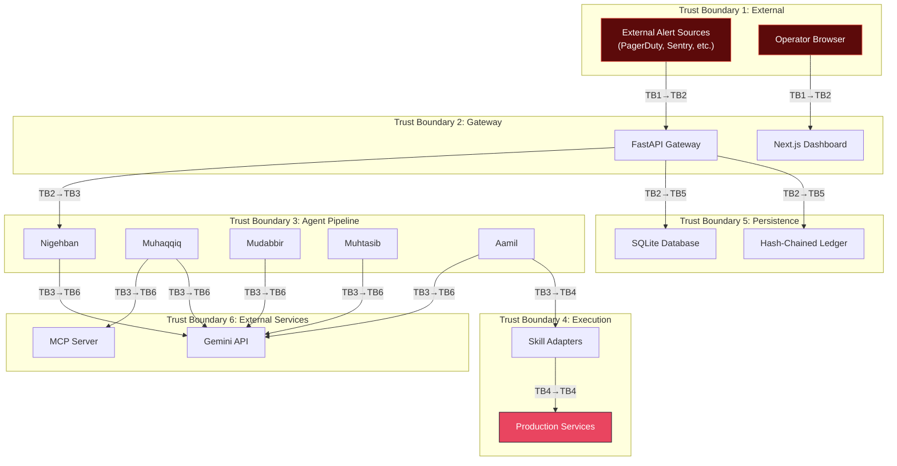
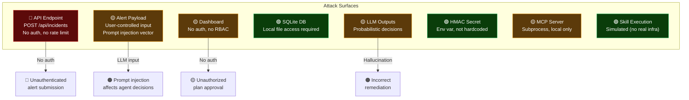

# MuhafizSRE — Threat Model

> Security analysis of a human-governed SRE system where AI agents propose and humans authorize remediation actions.

---

## 1. Overview

MuhafizSRE is a **human-governed multi-agent system** with the capability to propose and, upon human approval, execute remediation actions. This creates a significant attack surface that must be carefully managed. This threat model identifies attack vectors, assesses risk, and documents existing mitigations.

### Threat Modeling Methodology

This document uses a **STRIDE-aligned** approach:
- **S**poofing — Identity impersonation
- **T**ampering — Data modification
- **R**epudiation — Denying actions
- **I**nformation Disclosure — Data leakage
- **D**enial of Service — Availability attacks
- **E**levation of Privilege — Unauthorized access escalation

---

## 2. Asset Inventory

| Asset | Sensitivity | Description |
|-------|-------------|-------------|
| Production Services | **CRITICAL** | `auth-service`, `payment-gateway`, `user-service` |
| HMAC Secret Key | **CRITICAL** | `MUHAFIZ_APPROVAL_SECRET` — signs approval tokens |
| Gemini API Key | **HIGH** | `GEMINI_API_KEY` — LLM access |
| Approval Tokens | **HIGH** | HMAC-SHA256 tokens authorizing remediation |
| Audit Ledger | **HIGH** | Hash-chained event history (SQLite) |
| Remediation Plans | **HIGH** | Action envelopes with infrastructure commands |
| Agent Pipeline | **MEDIUM** | LLM-driven decision logic |
| Dashboard | **MEDIUM** | Human approval UI |

---

## 3. Trust Boundaries

---

## 4. Threat Catalogue

### T1: Prompt Injection via Alert Payload

| Attribute | Value |
|-----------|-------|
| **STRIDE** | Tampering, Elevation of Privilege |
| **Vector** | Malicious alert payloads crafted to manipulate LLM agent decisions |
| **Impact** | Agents produce harmful plans, bypass safety review, or execute unauthorized actions |
| **Likelihood** | MEDIUM |
| **Impact** | HIGH |
| **Risk Level** | 🟠 **HIGH** |

**Mitigations**:
1. ✅ Muhtasib (Auditor) adversarially reviews all plans using `gemini-3.1-pro-preview` (safety tier)
2. ✅ Deterministic action validation in `shared/action_policy.py` (no LLM involved)
3. ✅ Typed argument schemas (Pydantic) prevent freeform parameters
4. ✅ Target allowlist: only `auth-service`, `payment-gateway`, `user-service`
5. ✅ Skill allowlist: only 6 enumerated skills via `AllowedSkill` enum
6. ✅ Regex detection of shell metacharacters, URLs, path traversal, command injection
7. ✅ Forbidden operations blocklist (`delete_database`, `drop_table`, `rm_rf`, etc.)

**Residual Risk**: MEDIUM — LLM-based safety review is probabilistic, not deterministic. A sufficiently sophisticated prompt injection could bypass the Muhtasib's review.

---

### T2: Plan Tampering Between Stages

| Attribute | Value |
|-----------|-------|
| **STRIDE** | Tampering |
| **Vector** | Modify the remediation plan after safety review but before execution |
| **Impact** | Execute unauthorized or harmful actions |
| **Likelihood** | LOW |
| **Impact** | CRITICAL |
| **Risk Level** | 🟡 **MEDIUM** |

**Mitigations**:
1. ✅ SHA-256 `plan_hash` computed at plan commit time
2. ✅ Hash embedded in approval contract
3. ✅ HMAC-SHA256 token binds approval to specific plan hash
4. ✅ Contract `actions_json` frozen at issuance (immutable copy)
5. ✅ Single-process architecture — no inter-process plan transfer

**Residual Risk**: LOW — Plan is cryptographically bound to the contract.

---

### T3: Token Theft / Replay

| Attribute | Value |
|-----------|-------|
| **STRIDE** | Spoofing, Elevation of Privilege |
| **Vector** | Steal or replay approval tokens to execute plans without human approval |
| **Impact** | Unauthorized execution of remediation actions |
| **Likelihood** | LOW |
| **Impact** | CRITICAL |
| **Risk Level** | 🟡 **MEDIUM** |

**Mitigations**:
1. ✅ Raw HMAC token **never stored** — only `SHA-256(token)` persisted
2. ✅ HMAC recomputation required for verification (requires secret key)
3. ✅ TTL enforcement — expired tokens are rejected
4. ✅ One-time use — contract transitions to `CONSUMED` after execution
5. ✅ Constant-time comparison via `hmac.compare_digest()` (prevents timing attacks)
6. ✅ Unique nonce per contract (prevents cross-contract replay)

**Residual Risk**: LOW — Token cannot be recovered from database, and cannot be reused.

---

### T4: Ledger Tampering

| Attribute | Value |
|-----------|-------|
| **STRIDE** | Tampering, Repudiation |
| **Vector** | Modify or delete historical audit records in the SQLite database |
| **Impact** | Destroy audit trail, hide unauthorized actions, compromise change governance integrity |
| **Likelihood** | LOW |
| **Impact** | HIGH |
| **Risk Level** | 🟡 **MEDIUM** |

**Mitigations**:
1. ✅ SHA-256 hash chain links each event to its predecessor
2. ✅ `verify_chain()` detects any modification to historical events
3. ✅ Seal event with `pre_seal_head_hash` provides chain finality
4. ✅ Append-only design — no `UPDATE` or `DELETE` operations on events table
5. ✅ Monotonically increasing sequence numbers detect insertion/deletion

**Residual Risk**: LOW for modification (detectable via chain verification). MEDIUM for an attacker with direct database write access who could rewrite the entire chain from genesis.

---

### T5: Unauthorized Skill Execution

| Attribute | Value |
|-----------|-------|
| **STRIDE** | Elevation of Privilege |
| **Vector** | Execute remediation skills without a valid approval contract |
| **Impact** | Unauthorized changes to production infrastructure |
| **Likelihood** | LOW |
| **Impact** | CRITICAL |
| **Risk Level** | 🟡 **MEDIUM** |

**Mitigations**:
1. ✅ Skills only executable through `execute_action_graph()` pipeline
2. ✅ `validate_action_graph()` enforces: skill allowlist, target allowlist, argument schemas, acyclic dependencies
3. ✅ Forbidden operations blocklist: `delete_database`, `drop_table`, `exfiltrate_secret`, `rotate_all_credentials`, `disable_audit`, `rm_rf`, `format_disk`, `shutdown_cluster`
4. ✅ Numeric parameter bounds enforced by Pydantic schemas (e.g., `replicas` 1–6, `requests_per_second` 1–1000)
5. ✅ Typed `AllowedSkill` enum — arbitrary skill names rejected

**Residual Risk**: LOW — Multiple layers of deterministic validation.

---

### T6: Secret Exposure

| Attribute | Value |
|-----------|-------|
| **STRIDE** | Information Disclosure |
| **Vector** | Hardcoded secrets in source code, log leakage, database exposure |
| **Impact** | Compromise HMAC signing key, forge approval tokens |
| **Likelihood** | LOW |
| **Impact** | CRITICAL |
| **Risk Level** | 🟡 **MEDIUM** |

**Mitigations**:
1. ✅ All secrets loaded from environment variables (no hardcoding)
2. ✅ `Settings` class uses Pydantic for typed env var loading
3. ✅ `.env.example` template with placeholder values
4. ✅ Docker runs as non-root `muhafiz` user with `nologin` shell
5. ✅ Cloud Build uses Secret Manager for deployment secrets
6. ✅ `.gitignore` excludes `.env` files

**Residual Risk**: LOW — Standard secure practices followed.

---

### T7: Denial of Service

| Attribute | Value |
|-----------|-------|
| **STRIDE** | Denial of Service |
| **Vector** | Flood the system with alerts to overwhelm the pipeline |
| **Impact** | Pipeline backlog, resource exhaustion, delayed incident response |
| **Likelihood** | MEDIUM |
| **Impact** | MEDIUM |
| **Risk Level** | 🟡 **MEDIUM** |

**Mitigations**:
1. ✅ Writer lock serializes database writes (prevents write contention)
2. ✅ Pipeline runs are claimed (only one active per incident per phase)
3. ✅ TTL on approval contracts (prevents indefinite resource holding)
4. ⚠️ No explicit rate limiting on gateway API endpoints
5. ⚠️ No request authentication (any client can submit alerts)

**Residual Risk**: MEDIUM — No rate limiting or authentication on the gateway.

---

### T8: LLM Hallucination / Incorrect Diagnosis

| Attribute | Value |
|-----------|-------|
| **STRIDE** | Tampering (unintentional) |
| **Vector** | Agent produces incorrect root cause analysis or remediation plan |
| **Impact** | Execute wrong remediation, potentially worsen the incident |
| **Likelihood** | MEDIUM |
| **Impact** | HIGH |
| **Risk Level** | 🟠 **HIGH** |

**Mitigations**:
1. ✅ Multi-agent pipeline provides cross-validation (5 independent agents)
2. ✅ Muhtasib (Pro model) adversarially reviews all plans
3. ✅ Human approval gate as final checkpoint before execution
4. ✅ Recovery verification detects failed remediations post-execution
5. ✅ Safety challenge mechanism forces plan revision on concerns
6. ✅ Model selection strategy: 3-tier cognitive architecture — Flash Lite for speed, Flash for analytical, Pro for safety review

**Residual Risk**: MEDIUM — LLM decisions are inherently probabilistic. Human approval is the primary defense.

---

## 5. Risk Matrix Summary

| Threat ID | Category | STRIDE | Likelihood | Impact | Risk | Key Mitigation |
|-----------|----------|--------|------------|--------|------|----------------|
| T1 | Prompt Injection | T, E | Medium | High | 🟠 High | Deterministic validation + Auditor review |
| T2 | Plan Tampering | T | Low | Critical | 🟡 Medium | SHA-256 plan hash + HMAC token |
| T3 | Token Theft/Replay | S, E | Low | Critical | 🟡 Medium | No raw storage + TTL + one-time use |
| T4 | Ledger Tampering | T, R | Low | High | 🟡 Medium | SHA-256 hash chain + seal |
| T5 | Unauthorized Execution | E | Low | Critical | 🟡 Medium | Multi-layer deterministic validation |
| T6 | Secret Exposure | I | Low | Critical | 🟡 Medium | Env vars + Secret Manager |
| T7 | Denial of Service | D | Medium | Medium | 🟡 Medium | Writer lock + TTL |
| T8 | LLM Hallucination | T | Medium | High | 🟠 High | Multi-agent review + human gate |

---

## 6. Attack Surface Map

---

## 7. Recommendations for Production Hardening

| Priority | Recommendation | Addresses |
|----------|---------------|-----------|
| 🔴 **P0** | Add authentication (API keys / OAuth) to all gateway endpoints | T5, T7 |
| 🔴 **P0** | Add rate limiting to `/api/incidents` endpoint | T7 |
| 🟠 **P1** | Add dashboard authentication (OAuth/OIDC + RBAC) | T3, T5 |
| 🟠 **P1** | Implement input sanitization layer before LLM ingestion | T1 |
| 🟡 **P2** | Add external chain verification (periodic hash export) | T4 |
| 🟡 **P2** | Implement alert deduplication to prevent flooding | T7 |
| 🟢 **P3** | Add structured output validation on all LLM responses | T8 |
| 🟢 **P3** | Implement rollback-of-rollback capability | T8 |

---

## Production Hardening Roadmap

MuhafizSRE is a governed multi-agent SRE prototype with deterministic synthetic enterprise telemetry, real ADK agent workflows, HMAC-bound human approval contracts, and real local Docker sandbox remediation. For Fortune-500 production deployment, the next hardening steps are:

1. **Durable orchestration** — Move long-running agent workflows from FastAPI in-process background tasks to Temporal, Cloud Tasks, Celery, or Step Functions.
2. **Backpressure and rate limits** — Add tenant-level concurrency controls, LLM quota management, alert deduplication, priority queues, and budget ceilings.
3. **Production data plane** — Replace SQLite with Postgres/Cloud SQL, add row-level tenant isolation, and anchor terminal event seals to external append-only storage.
4. **Multi-tenant identity** — Add organization_id/workspace_id to incidents, contracts, events, and room messages. Enforce RBAC from authenticated JWT claims.
5. **Real infrastructure adapters** — Replace simulated enterprise skill adapters with parameterized Kubernetes, GCP, Secret Manager, PagerDuty, and ServiceNow integrations.
6. **Resumable execution** — Add idempotent action checkpoints, retry policies, compensation actions, and operator-controlled resume/reissue flows.

